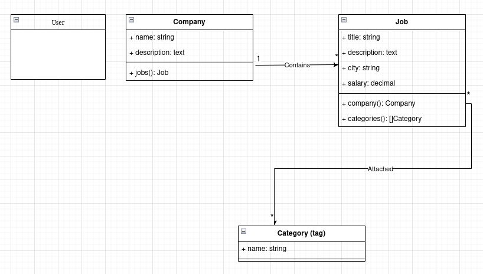

## Run

```bash
git clone git@lena.github.com:LenaBerezh/laravel-example-app.git
cd laravel-example-app

# composer install
docker run --rm \
    --pull=always \
    -v "$(pwd)":/opt \
    -w /opt \
    laravelsail/php82-composer:latest bash -c 'composer install'

# fix permissions after running composer install in docker
sudo chown -R $USER: .

# launch application
APP_PORT=8080 vendor/bin/sail up

# setup database with fake data
vendor/bin/sail artisan migrate:refresh --seed
```

Die .env sollte nicht zu Repository hinzugefügt werden. Aber ich habe es für diese Spielzeuganwendung gemacht, um das Starten der App zu vereinfachen.

http://localhost:8080/

## Konzept


